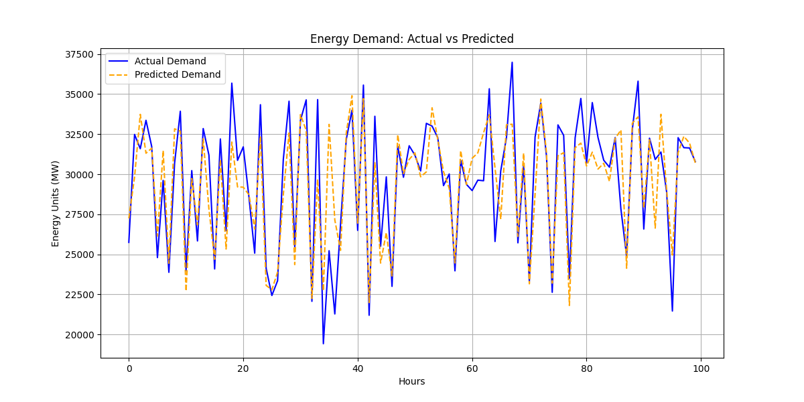

# ⚡ SMARTGRID-AI: Energy Prediction Dashboard

## Overview

SMARTGRID-AI is a machine learning project that predicts electricity demand and detects abnormal energy consumption patterns in power grids.

The system uses **Random Forest Regression** to learn historical energy usage and forecast future electricity demand.
An interactive **Streamlit dashboard** allows users to visualize predictions and sustainability insights.

---

## Features

* Energy demand prediction using **Random Forest Machine Learning**
* Energy waste anomaly detection
* Visualization of **Actual vs Predicted electricity demand**
* CO₂ emission reduction estimation
* Interactive **Streamlit dashboard**

---

## Dataset

The dataset contains **35,000+ hourly electricity records** including:

* Energy generation sources
* Forecast electricity demand
* Actual grid load
* Electricity market prices

---

## Machine Learning Model

The system performs:

1. Data preprocessing
2. Feature engineering
3. Random Forest regression
4. Energy demand prediction
5. Anomaly detection

Features used:

* Hour
* Day of week
* Month
* Weekend indicator
* Night usage

---

## Model Performance

Average prediction error:

2043.47 MW

### Energy Demand Prediction

This graph compares the **actual electricity demand** with the **AI predicted demand**.

The close alignment between the two curves shows that the model successfully learns energy consumption patterns.

---

## Run the Project

Install dependencies:

pip install -r requirements.txt

Run the machine learning model:

python smartgrid_ai.py

Run the dashboard:

streamlit run dashboard.py

Open browser:

http://localhost:8501

---

## Technologies Used

Python
Pandas
NumPy
Scikit-learn
Matplotlib
Seaborn
Streamlit

---

## Author

**Srija Kandimalla**

